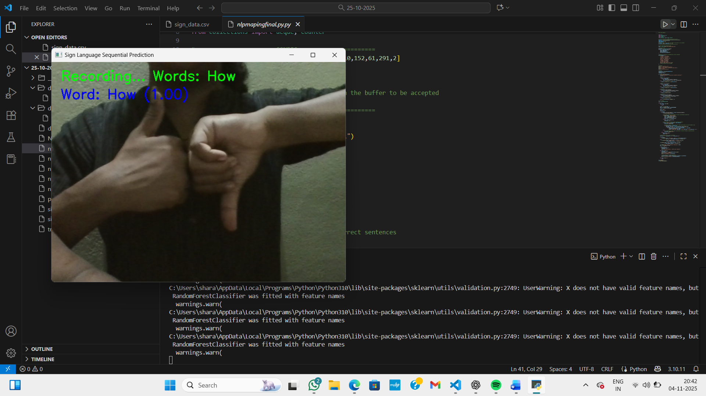
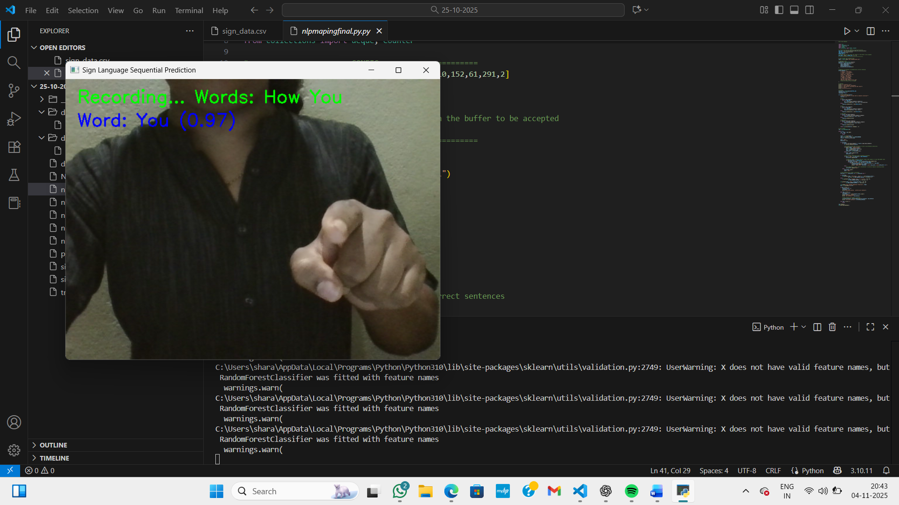
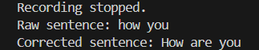

# 🤟 Sign-to-Sentence: Real-Time Sign Language Recognition and Translation System

> 🎓 **Team Mini Project** | Foundation for our ongoing Sign Language Recognition major project


---

## 📖 Overview

Sign-to-Sentence is a real-time sign language recognition system developed using **Computer Vision** and **Machine Learning** to help bridge the communication gap between hearing-impaired individuals and non-sign language users.

The system captures live webcam input, extracts **hand**, **pose**, and **facial landmarks** using **MediaPipe Holistic**, predicts sign gestures using a **Random Forest classifier**, and converts recognized signs into meaningful English sentences through a language mapping module.

This project serves as the **foundation for our ongoing major project**, where we are extending the system with continuous sign recognition, deep learning models, and improved natural language generation.

---

## 🎯 Problem Statement

Sign language is one of the primary communication methods for people with hearing and speech impairments. However, many individuals are not familiar with sign language, making everyday communication difficult.

This project aims to reduce this communication gap by recognizing sign language gestures in real time using computer vision and machine learning techniques. The system translates recognized gestures into meaningful English text without requiring wearable sensors or specialized hardware, making it an accessible and cost-effective solution.

---

## ✨ Key Features

- 📹 Real-time sign language recognition using live webcam input
- ✋ Hand, face, and pose landmark extraction using **MediaPipe Holistic**
- 📊 Automatic dataset collection with manual label management
- 🤖 Machine Learning-based sign prediction using a **Random Forest Classifier**
- 🎯 Confidence-based prediction filtering for improved accuracy
- 🔄 Temporal smoothing using a prediction buffer for stable recognition
- 📝 Sentence generation using predefined phrase mapping
- 💻 Vision-based solution without wearable sensors or specialized hardware

---

## 🏗️ System Architecture

```text
                    📹 Webcam Input
                           │
                           ▼
                MediaPipe Holistic Detection
        ┌──────────────┬──────────────┬──────────────┐
        ▼              ▼              ▼
   Hand Landmarks   Pose Landmarks   Face Landmarks
        └──────────────┴──────────────┘
                       │
                       ▼
             Feature Extraction & Storage
                       │
                       ▼
                CSV Dataset Collection
                       │
                       ▼
          Random Forest Model Training
                       │
                       ▼
             Real-Time Gesture Prediction
                       │
                       ▼
         Confidence Threshold Filtering
                       │
                       ▼
              Temporal Smoothing Buffer
                       │
                       ▼
             Phrase Mapping & Correction
                       │
                       ▼
              English Sentence Output
```


---

## ⚙️ Project Workflow

1. Capture live video from the webcam.
2. Detect hand, pose, and facial landmarks using MediaPipe Holistic.
3. Extract landmark coordinates and generate feature vectors.
4. Store the extracted features in a CSV dataset.
5. Train a Random Forest classifier using the collected dataset.
6. Perform real-time gesture prediction from live webcam input.
7. Apply confidence thresholding and temporal smoothing for stable predictions.
8. Convert recognized gesture sequences into meaningful English sentences using phrase mapping.


---

## 📂 Project Structure

```text
Sign-language/
│
├── dataset.py                 # Dataset collection using MediaPipe
├── training.py                # Random Forest model training
├── prediction.py              # Real-time sign prediction
├── dataset/
│   └── sign_data.csv          # Landmark dataset
├── sign_language_model.pkl    # Trained model
├── screenshots/               # Project screenshots
├── README.md
└── requirements.txt
```


---

## 🛠️ Technologies Used

| Category | Technologies |
|-----------|--------------|
| Programming Language | Python |
| Computer Vision | OpenCV, MediaPipe Holistic |
| Machine Learning | Scikit-learn (Random Forest Classifier) |
| Data Processing | NumPy, Pandas |
| Model Persistence | Joblib |
| Data Storage | CSV |
| Development Tools | Visual Studio Code, Git, GitHub |


---

## 📸 Project Demonstration

### 1️⃣ Gesture Recognition

The system detects and recognizes individual sign language gestures in real time using **MediaPipe Holistic** and a trained **Random Forest** classifier.

<p align="center">
  
</p>

---

### 2️⃣ Sequential Sign Recognition

The recognized gestures are accumulated using **temporal smoothing** to form a continuous sign sequence before sentence generation.

<p align="center">
  
</p>

---

### 3️⃣ Sentence Generation

The recognized sign sequence is transformed into a grammatically correct English sentence using the **phrase mapping** module.

<p align="center">
  
</p>


## 🚀 How to Run

1. Clone this repository.
2. Install the required Python libraries.
3. Run `dataset.py` to collect sign language data.
4. Run `training.py` to train the Random Forest model.
5. Run `prediction.py` to perform real-time sign language recognition.


---

## 🔮 Future Improvements

- Replace the Random Forest classifier with CNN-LSTM or Transformer-based models for improved sequential sign recognition.
- Expand the dataset to support a larger vocabulary of sign language gestures.
- Implement semantic sentence generation using advanced Natural Language Processing (NLP).
- Integrate Text-to-Speech (TTS) to convert generated sentences into spoken language.
- Add multilingual translation support.
- Improve recognition accuracy under different lighting conditions and backgrounds.
- Deploy the application as a web or mobile application for better accessibility.

---

## 🙏 Acknowledgements

This project was developed as part of the Artificial Intelligence and Machine Learning curriculum. We thank our faculty members and mentors for their valuable guidance and support throughout the project development process.

---

## 👥 Team Members

This project was developed collaboratively as a team mini project.

- Akshaya Shankari B
- Dhanya B K
- Sharanya Rai K
- Srijanya S R


